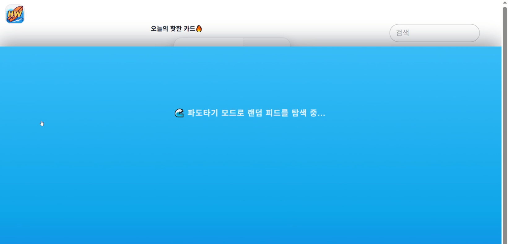

# 🌊 HobbyWave (Kidult SNS)

키덜트·취미 기반 SNS 플랫폼으로  
취향 기반 피드, 파도타기 알고리즘, 북마크, 프로필 시스템을 제공하는 SNS 프로젝트입니다.

---

## ⭐ 주요 기능

---

## 🏠 1. 홈 피드 (전체 피드)

- 전체 사용자 피드를 최신순으로 조회
- 게시글 카드를 통해 이미지/내용 표시
- 좋아요 / 북마크 여부 UI 표시
- 상세 모달에서 댓글 확인 및 입력 가능

---

## 🌊 2. 파도타기 (랜덤 탐색 모드)

- 전체 피드를 *무작위* 로 섞어서 노출
- “새로운 취미를 탐험한다”는 컨셉
- 파도타기 진입 시 파도 애니메이션 등장
- 전용 설명 모달 제공
  

---

## 📎 3. 북마크 (다시보기)

- `tbl_feed_bookmark` 기반
- 클릭 시 toggle 방식 (북마크 추가 ⇄ 취소)
- 북마크한 게시글만 모아서 확인 가능

---

## 👤 4. 마이페이지

- 사용자 프로필 정보 조회
- 닉네임, 소개글, 프로필사진 표시
- 활동량에 따라 프로필 아바타 테두리 색상 변화  
  - 브론즈 / 실버 / 골드 / 에메랄드 등급 시스템
  

---

## 📦 5. 서버 & DB 구조

### ✔️ 주요 테이블
- `tbl_user` — 사용자 정보, 프로필, 팔로워 수 등
- `tbl_feed` — 피드 본문 / 내용
- `tbl_feed_img` — 게시글 이미지
- `tbl_feed_like` — 좋아요 정보
- `tbl_feed_bookmark` — 북마크 정보
- `tbl_follow` — 팔로우 관계
- `tbl_user_tag_score` — 취향 기반 알고리즘 점수

백엔드는 Node.js + Express + MySQL 기반이며  
프론트는 React + MUI를 기반으로 개발되었습니다.

---

## 🧪 6. 기술 주요 포인트

- React Router 기반 화면 이동
- MUI(Material UI)로 모던한 UI 구성
- JWT 기반 인증 구조
- multer로 이미지 업로드 처리
- feed 랜덤 정렬(shuffle) 알고리즘
- 활동량 기반 사용자 등급 계산

---

## 🚀 개발 목표

- 키덜트 취미 기반 SNS에서의 새로운 탐험 경험 제공
- 콘텐츠 기반 취향 추천 구조 설계
- 가벼운 SNS이지만 직관적이고 모던한 UI 구현
